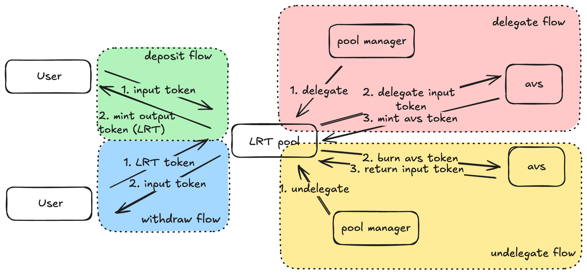
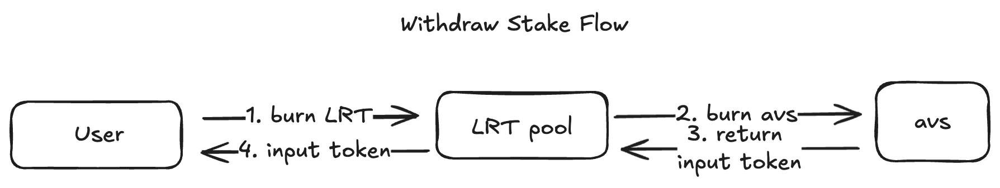
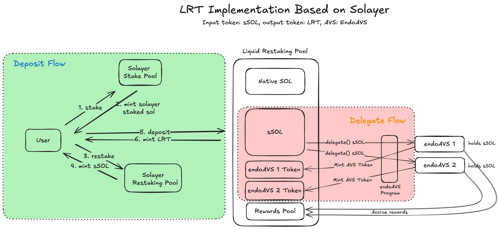
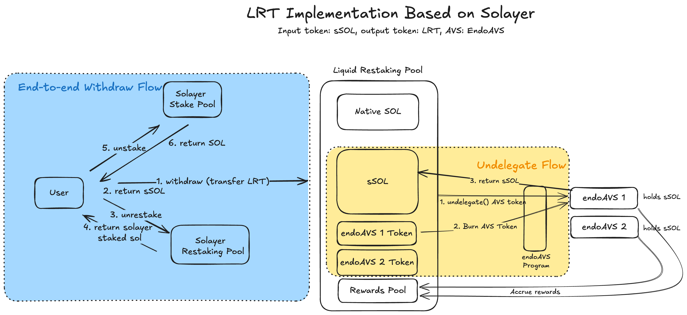

# Adra LRT

This repository is an early beta implementation of liquid restaking protocol. The codebase is designed to be general with tests over all major functionalities. However, due to the limited available restaking protocol in solana, this repo uses Solayer EndoAvs as the example in part of the tests.

## Disclaimer
This repository contains unaudited smart contract code. The code is provided “as-is” and has not undergone a formal security audit. Use this code at your own risk.

## Installation

Clone this repository and install the dependencies:

```
yarn install
```

You can start running tests after the above step. However if you need to make changes to the program, you will need to:

```
anchor build
anchor deploy
```
This will deploy the program to devnet where the testing scripts run on.

## Scope
As a restaking protocol, an input token and an output token (LRT) is needed for the restaking pool. Input token can be any form of asset the pool takes and output token should be the liquid restaking token issued by the restaking pool. Users transfer input token to the restaking pool and should get output token (LRT) back. Under the hood, the restaking pool delegate authority delegates/undelegates the input token to AVSs and manage the AVS token. Users should be able to withdraw their fund anytime, even if there is no enough input token liquidity in the restaking pool.

## Normal Flow
There are four normal workflow within this implementation: deposit, withdraw, delegate, and undelegate.


### Deposit
User transfer input token to the retaking pool and should get output token (LRT) back.

### Withdraw
User transfer output token to the restaking pool and should get inout token back.

### Delegate
The delegate authority of the restaking pool delegates the input token to specific AVS and the pool should get back AVS token.

### Undelegate
The delegate authority undelegate asset from AVS through transfer the AVS token to the AVS and get back input token.

## Withdraw Stake Flow
Users' withdrawal requests could fail if there is not enough input token liquidity in the pool. It could happen due to lots of reasons such as restaking pool delegate authority delegates all the input token to AVSs or the delegate authority key is lost. In this case, users can force the pool to undelegate from certain AVS and get input token back.



## Run Local Tests 
Currently we run local tests using Bankrun, the testing module pulls in the required account data from mainnet and tests the program call behavior.
```
BPF_OUT_DIR=tests/programs yarn run ts-mocha -p ./tsconfig.json -t 1000000 tests/**/*.ts
```
NOTE: Programs are loaded in from the `BPF_OUT_DIR` directory so make sure if you update your program its copied over to that directory.

## Run Devnet Tests
We have scripts to test over all flow. Before you run any test command, you should initialize the pool by:
```
yarn init-pool
```

Note that you could encounter the following error when you run yarn init-pool command:

```
Create Account: account Address { address: QZbCJigCCL1dDoKdC3sbNi92c7GznCnChuVL8az7uCH, base: None } already in use
```

It means that the output token has been created and the pool has been initialized. You should create a new output token keypair under keys folder and delete the old one. Use the following command:
```
mkdir keys;
solana-keygen new -o ./keys/output_token_mint.json --force
yarn init-pool
```

Then you can run any tests through the following command one by one:
```
yarn deposit
```
```
yarn transfer-authority
```
```
yarn delegate
```
```
yarn undelegate
```
```
yarn withdraw
```
```
yarn withdraw-stake
```

Note that some tests could be a little flicky given that RPC endpoint may not have the latest on-chain info. You should check the printed transaction hash to verify onchain tx is indeed successful.

### Deposit and Delegate Test
In the deposit ande delegate tests we use Solayer sSOL as the input token and Solayer EndoAvs as the AVS. The following diagram describes the detail of the flow.



### Withdraw and Undelegate Test
Similarly, we use Solayer sSOL and Solayer EndoAvs in the withdraw and undelegate tests as well.

